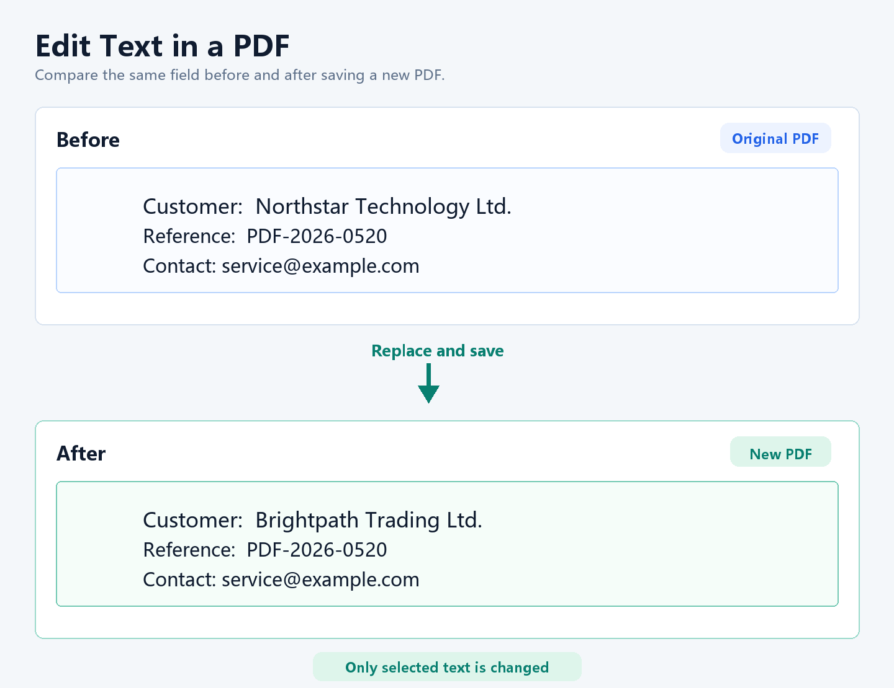
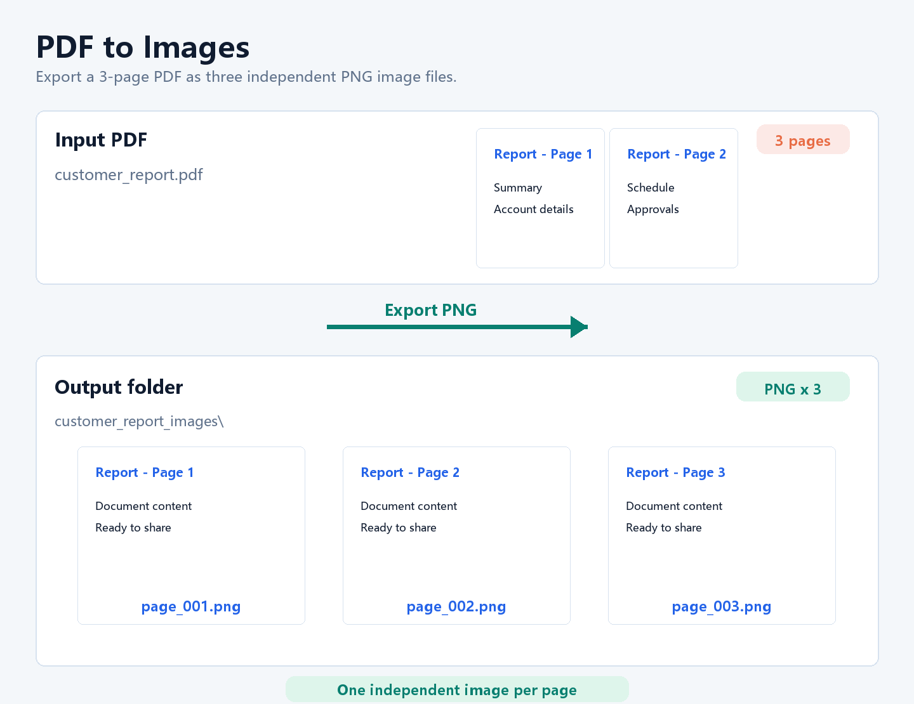
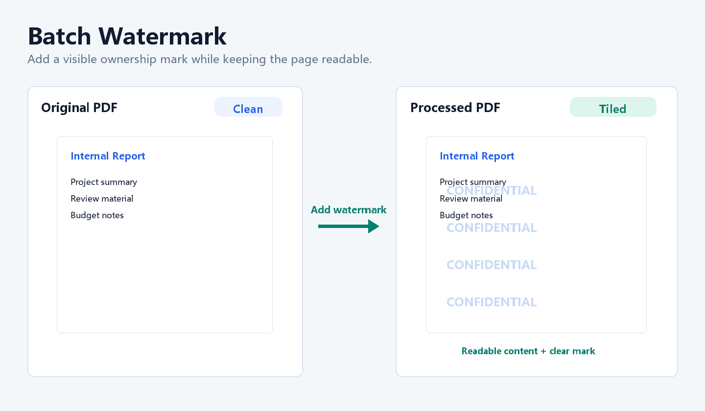
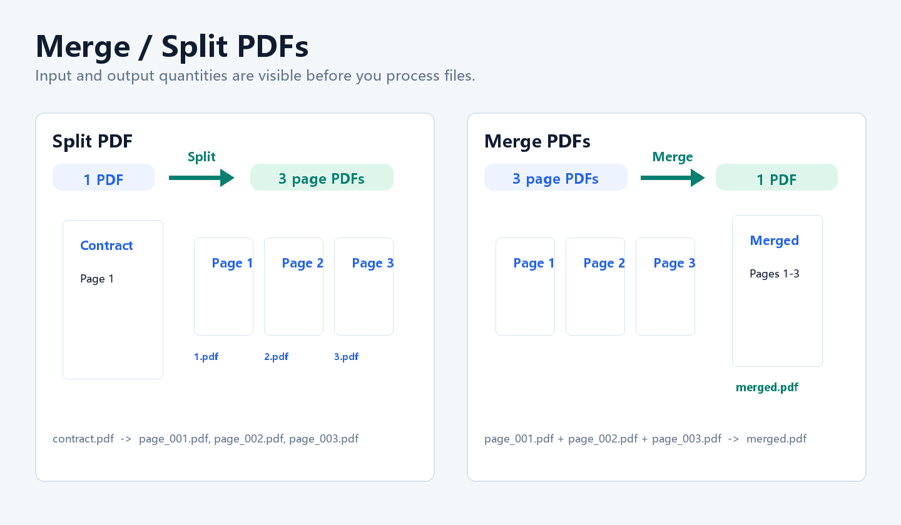
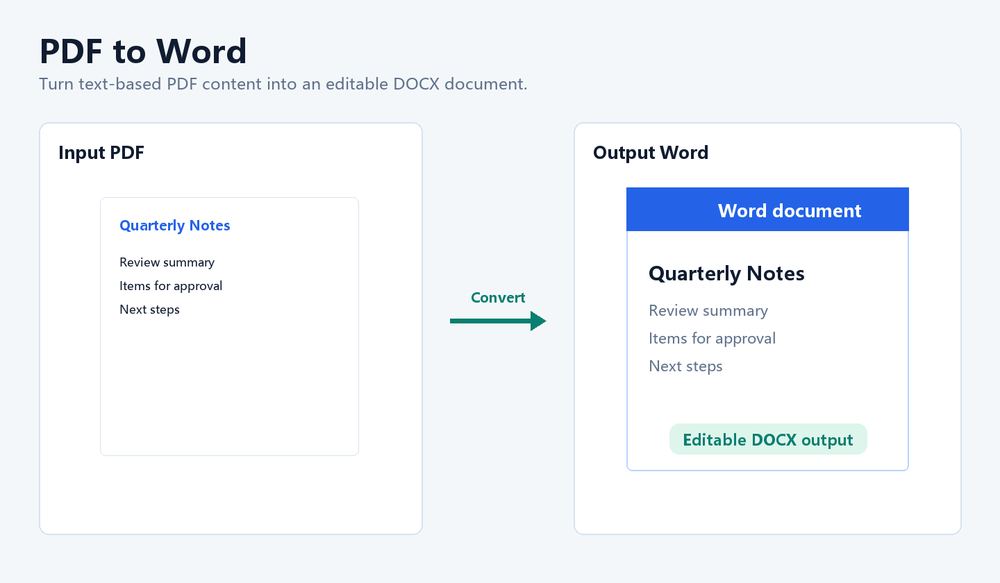

# Doclira PDF Lite

**Local-first PDF privacy checks for Windows office documents.**

Doclira PDF Lite is the public product hub for Doclira PDF. It explains the workflow, collects feedback, and points users to the official Windows installer. The commercial desktop app is distributed separately.

[Official Website](https://www.doclira.com/) | [Download Windows App](https://www.doclira.com/download/) | [Buy License](https://taixianglumark.gumroad.com/l/doclira-pdf) | [Feedback](https://www.doclira.com/feedback/)

## What problem does Doclira solve?

Before you email or upload a PDF, you may need to check whether it exposes private or internal information.

Doclira focuses on this pre-send workflow:

1. Open a contract, invoice, form or client document.
2. Check for sensitive data such as emails, phone numbers, ID-style numbers, card-like numbers and amounts.
3. Apply real redaction and save a new PDF.
4. Run a PDF security audit for metadata, annotations, links, forms and embedded files.
5. Use everyday PDF tools such as watermark, Word export, images, compression, merge and split.

## Core workflows

| Workflow | Why it matters |
| --- | --- |
| Smart Redaction | Find and remove sensitive data before sharing a PDF externally. |
| Security Audit | Check metadata, links, annotations, forms, scripts and embedded files. |
| Batch Watermark | Add text or logo watermarks to multiple PDFs for review and internal sharing. |
| AI Chat | Ask questions, summarize, translate and extract information from readable PDF text. |
| PDF to Word | Convert ordinary text-based PDFs into editable DOCX files. |
| PDF to Images | Export pages as PNG images for review or sharing. |
| Compress, Merge, Split | Handle common office PDF operations in one Windows app. |

## Product preview

| PDF to Images | Batch Watermark | Merge and Split |
| --- | --- | --- |
|  |  |  |

## Download and activation

- Download the Windows installer from [doclira.com/download](https://www.doclira.com/download/).
- The installer can be tried before purchase with visible free usage limits.
- Paid licenses are delivered through Gumroad as activation keys.
- AI credits are visible in the app and can be topped up separately.

## Honest scope

Doclira PDF is not trying to replace Acrobat, Foxit, PDF-XChange or UPDF for every possible PDF editing workflow. It is designed for practical office tasks:

- pre-send privacy checks
- redaction and security audit
- batch watermarking
- conversion, compression, merge and split
- lightweight text corrections

Complex visual PDF redesign, scanned OCR-heavy files and perfect Word-like editing are outside the current promise.

## Useful pages

- PDF redaction tool for Windows: https://www.doclira.com/pdf-redaction-tool-windows/
- Redact sensitive information in PDFs: https://www.doclira.com/redact-sensitive-information-pdf/
- PDF security audit tool: https://www.doclira.com/pdf-security-audit-tool/
- Free PDF privacy checker: https://www.doclira.com/free-pdf-privacy-checker-windows/
- Batch watermark PDF on Windows: https://www.doclira.com/batch-watermark-pdf-windows/
- User guide: https://www.doclira.com/guide/

## Feedback wanted

If you handle contracts, invoices, forms, client files or internal PDFs, feedback is welcome:

- What would make you trust or not trust a redaction tool?
- Do you care whether redacted text can no longer be searched or copied?
- Would a security audit for metadata, comments, links and attachments be useful?
- Which step feels confusing before purchase?

Open an issue or use the website feedback page. Do not upload confidential PDFs, license keys or private customer data to public GitHub issues.

## License

Copyright (c) 2026 Doclira. The commercial Windows application is proprietary software. This public repository contains product documentation, preview assets and support materials only.
