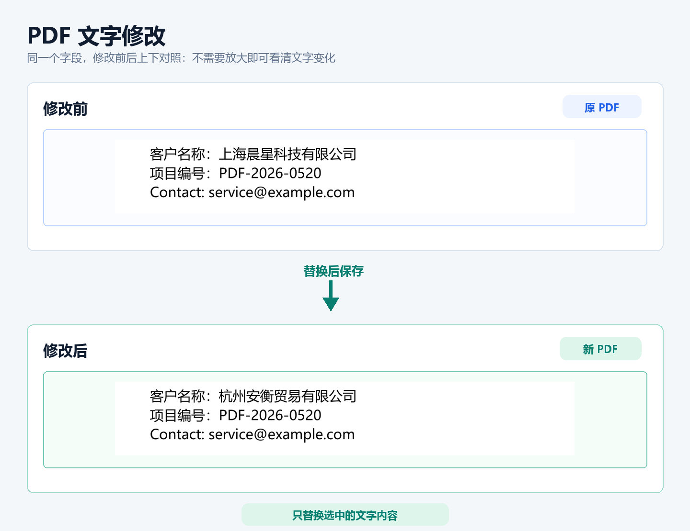
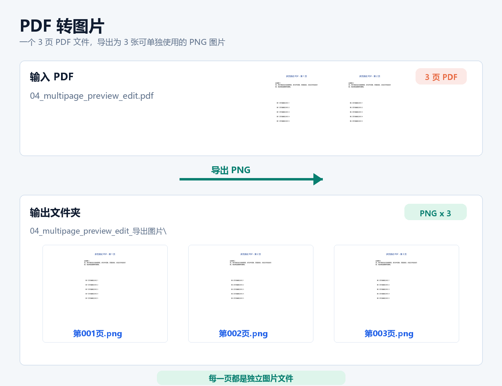
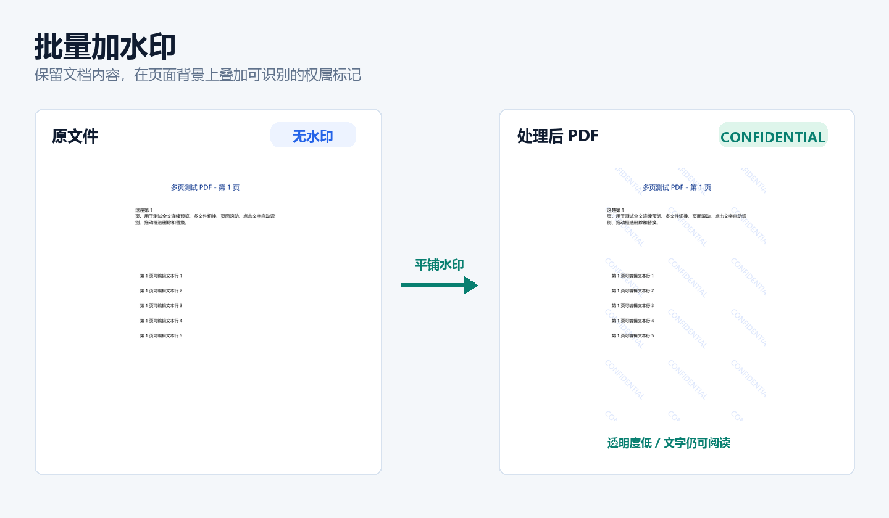
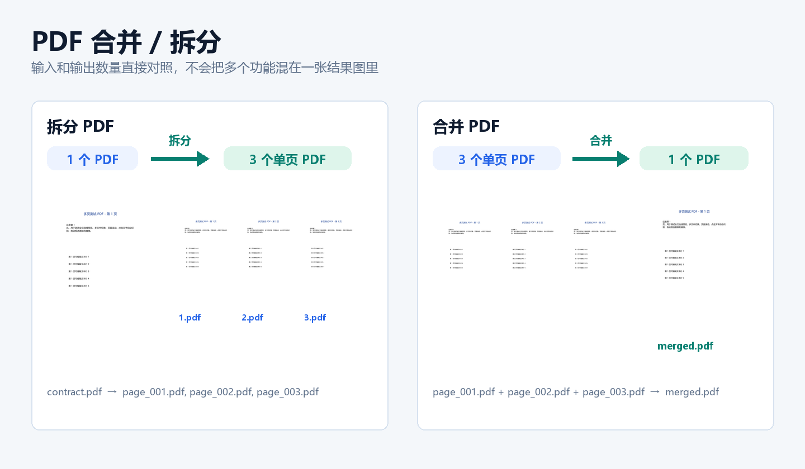
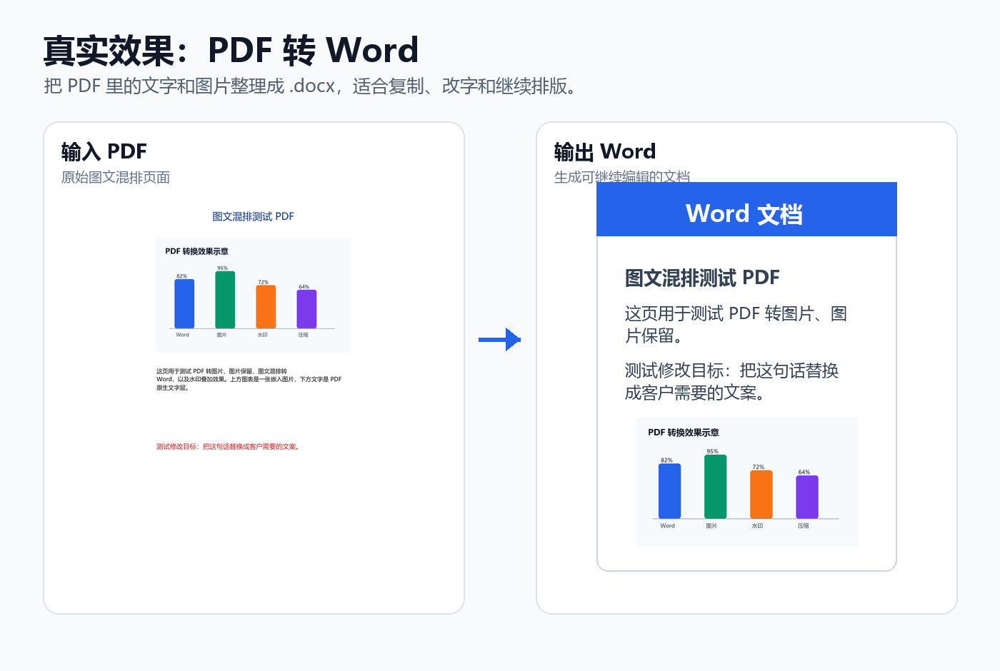

# Doclira PDF

**面向 Windows 的实用 PDF 桌面工具。**

Doclira PDF 用于处理办公中会反复出现的 PDF 工作：批量加水印、PDF 转 Word、PDF 转图片、压缩、合并拆分、图片转 PDF 以及少量文字修改。核心文件处理在本机完成。

> 本仓库是公开的产品介绍和反馈入口。付费安装包与激活码通过正式购买渠道发放，不放在公开仓库中。

[官方网站](https://www.doclira.com/zh/) | [前往 Gumroad 购买](https://taixianglumark.gumroad.com/l/doclira-pdf) | Windows 10 / 11 64 位 | 一次性授权：$19

## 主要功能

| 功能 | 用途 |
| --- | --- |
| 批量水印 | 文字或 Logo 水印，支持平铺、透明度、角度和页码范围 |
| PDF 转 Word | 将普通文本型 PDF 生成可继续编辑的 DOCX |
| PDF 转图片 | 将 PDF 各页导出为清晰 PNG |
| 压缩 | 适用于邮件、微信或系统上传的质量档位 |
| 合并 / 拆分 | 整理多个 PDF 或拆出单页文件 |
| 图片转 PDF | 将多张图片组织为一个 PDF |
| 简单填改 | 预览中进行少量文字替换、删除或添加 |

## 实际效果

| PDF 转图片 | 批量加水印 | 合并与拆分 |
| --- | --- | --- |
|  |  |  |

## 适用系统

- Windows 10 / Windows 11
- 当前发布版本仅支持 64 位系统

## 功能边界

PDF 并不是 Word 文档。Doclira PDF 主打稳定的常用处理和少量文字修正，不承诺复杂扫描件、特殊字体或复杂排版都可以像 Word 一样无损重排。

## 使用流程

1. 在 [Gumroad 商品页](https://taixianglumark.gumroad.com/l/doclira-pdf) 购买后下载 Windows 安装包。
2. 从订单收据或下载页面复制 Gumroad 自动生成的唯一激活码。
3. 打开软件并输入激活码，首次激活需要联网验证。
4. 激活成功后，这台电脑可离线使用软件。
5. 添加文件、选择输出目录并执行功能，在本机检查生成结果。

## 发货与激活

- Gumroad 会在每笔订单中自动发送唯一 License Key。
- 软件首次激活时在线验证该密钥。
- 成功激活后，本机后续使用无需持续联网。
- 安装包仅通过正式购买渠道提供，不在公开仓库中下载。

## 链接

- 购买地址：[Gumroad](https://taixianglumark.gumroad.com/l/doclira-pdf)
- 产品官网：[https://www.doclira.com/zh/](https://www.doclira.com/zh/)
- 使用指南：[https://www.doclira.com/zh/guide/](https://www.doclira.com/zh/guide/)
- 售后邮箱：[lienowen@outlook.com](mailto:lienowen@outlook.com)

## 反馈说明

请使用仓库中的 Issue 模板反馈可复现问题或提出需求。不要在公开 Issue 中上传隐私文件或激活码。购买或激活问题请发送邮件至 [lienowen@outlook.com](mailto:lienowen@outlook.com)。
